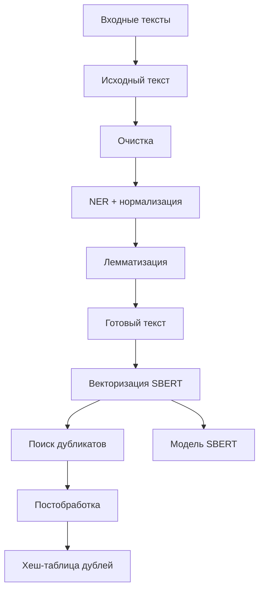

# Система выявления дубликатов текстов в строительной тематике

## Архитектура



## Этапы обработки

### 1. Подготовка данных

- **Создание пар текстов с метками схожести** (1 — дубликат, 0 — не дубликат)
- **Словари**:
  - Синонимов — через Word2Vec + ручная фильтрация
  - Сокращений — вручную или semi-автоматически
- **Очистка текста**: удаление символов `! ? ( ) « » “ ”`
- **Лемматизация**
- **NER + нормализация сущностей**
- **Аугментация**:
  - Обратный перевод
  - Замена терминов по словарю

### 2. Векторизация

- **Модель**: `sentence-transformers/paraphrase-multilingual-mpnet-base-v2`
- **Оптимизация**:
  - Кэширование эмбеддингов через **Redis**

### 3. Алгоритм транзитивного объединения дубликатов

```text
Для нового текста:
    1. Генерируем хеш нормализованного текста с сущностями
    2. Если хеш есть в hash_index:
        - Получаем doc_id оригинала
        - Добавляем в существующую группу
    3. Иначе:
        - Присваиваем новый уникальный doc_id
        - Создаем новую группу
```

### 4. Хранение данных

```json
{
  "groups": {
    "0": [0, 2, 5],
    "1": [1, 3]
  },
  "title": {
    "0": "бетон…",
    "1": "условия..."
  },
  "description": {
    "0": "бетон М500...",
    "1": "технические условия..."
  },
  "hash_index": {
    "a1b2c3d4": 0,
    "e5f6g7h8": 1
  }
}
```

## Используемые технологии

- `Python`, `SentenceTransformers`, `Redis`, `Natasha`
- Дополнительно: `gensim`, `nltk`, `deep-translator`

## Планы по улучшению

- Обучение собственной NER-модели на строительной тематике
- Расширение словарей синонимов и терминов
